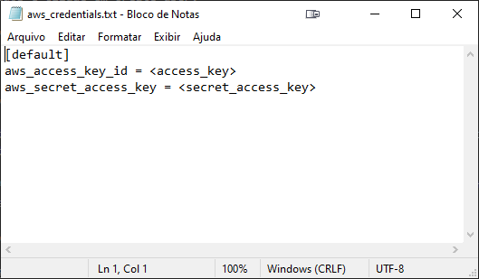

**Implantação em Amazon Web Services (AWS) utilizado recurso EC2 de planta virtual utilizando node-red e supervisório utilizando Scada-LTS.**

1.  Pré-requisitos

    1.  Ter conta no Amazon Web Services (AWS): <https://aws.amazon.com>

    2.  Conhecimento básico em informática, git e execução de comandos shell.

2.  Clonar o repositório no GitHub: <https://github.com/rlmariz/virtual-lab-deploy.git>

3.  Após clonar o repositório a pasta de trabalho será **“virtual-lab-deploy\\aws”**, todos os arquivos salvos e comandos executados devem ser nessa pasta.

4.  Criar conta de acesso para ser utilizado o terraform no AWS

    1.  Acesse o console da AWS e faça o login com sua conta e pesquise pelo produto IAM (Identity and Access Management).

    

    2.  Iremos criar um usuário para que o terraform possa interagir com a AWS, clique em USERS e em seguida em ADD USER.

    

    3.  Definir detalhes do usuário.

    

    4.  Adicione a política AmazonEC2FullAccess ao usuário, o que dará permissão total ao usuário apenas a recursos da EC2, e clique em Next.

    

    5.  Tags são utilizadas para adicionar informações relevantes ao usuario, clique em Next.

    

    6. Verifique os dados e clique em Create user.

    

    7. Clique em show e copie o Access key ID e Secret access key

    

    8. O usuário criado e chave de acesso não devem ser compartilhados, uma vez que quem tiver acesso a estes dados terá controle sobre os recursos adicionados como política.

5.  Editar arquivo ***aws_credentials.txt*** e adicionar a chave de acesso e a chave secreta substituindo os valores **\<access_key\>** e **\<secret_access_key\>**.

    

6.  Acessar o site e gerar par de chaves rsa que será utilizado para conexão ssh.

    1.  Acesso o website [https://www.wpoven.com/tools/create-ssh-key#](https://www.wpoven.com/tools/create-ssh-key)

    2.  Configure o type como rsa, length 2048, password deixe em branco e clique em create key.

    

    3.  Fazer download do ***Private Key*** e salvar arquivo com nome ***aws.key***.

    4.  Fazer download do ***Public Key*** e salvar arquivo com nome ***aws.pub.key***.

7.  Instalar o Terraform

    1.  Acesse o site <https://www.terraform.io/downloads>.

    2.  Siga as instruções de acordo o sistema operacional que está utilizando.

    3.  Ao fazer o download do executável de preferência coloque na pasta de trabalho para facilitar sua utilização.

    4.  Pode ser feito o teste para verificar se está tudo ok executando no prompt de comandos: 
        <pre><code>
        terraform –version
        </code></pre>

    5.  Vai exibir a versão instalada e a plataforma: 
        <pre><code>
        Terraform v1.1.7 
        on windows_amd64
        </code></pre>        

8.  Caso seja necessário pode se editar o arquivo variables.tf e fazer os ajustes necessários.

9.  Executar o comando para instalar os requisitos do terraform.

<pre><code>
terraform init
</code></pre>

10.  O próximo passo é criar infraestrutura e subir aplicação, vamos executar o comando:

<pre><code>
terraform apply
</code></pre>

11.  Vai ser exibido o plano de trabalho e estando tudo ok basta digitar “yes” e dar enter.

12. O processo leva certa de 6 minutos para ser implementado e ao final será exibido os endpoints para acesso ao supervisório, node-red e caso necessário o comando para acesso via ssh.

    

13. O usuário e senha para acesso ao supervisório é ***admin/admin***.

14. É muito importante desalocar os recursos após finalizar sua utilização para não ter custos extras, para fazer isso basta executar o comando abaixo e confirmar com yes, ao final os recursos serão desalocado.
    
    <pre><code>terraform destroy</code></pre>

    
